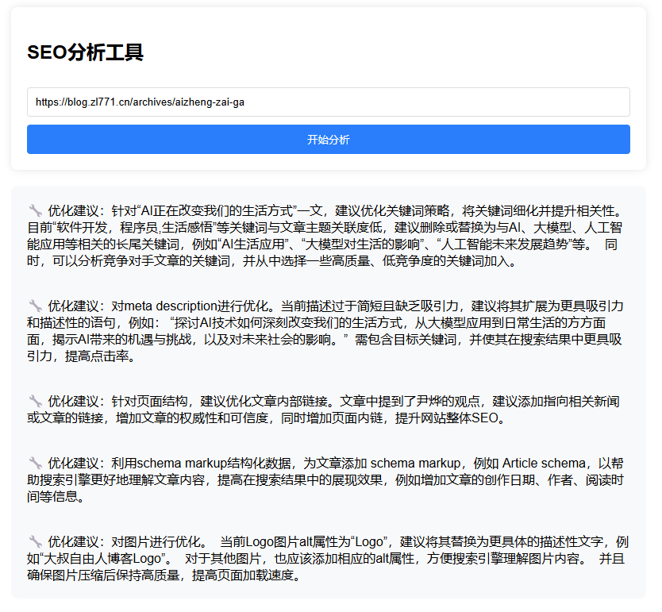

# 基于 Cloudflare Worker 的 SEO 分析工具实现

先上个效果图

## 📖 项目介绍

这是一个基于 Cloudflare Worker 和 Cloudflare AI 构建的 SEO 分析工具。通过边缘计算和 AI 能力，为网页提供实时的 SEO 分析和优化建议。

## 🔧 技术架构

- **运行环境**: Cloudflare Worker (边缘计算) 
- **AI 能力**: Cloudflare AI API
- **部署方式**: Wrangler CLI
- **响应速度**: 全球化边缘节点，平均延迟 < 50ms

## 💡 核心功能实现

### 1. HTML 解析引擎
- 使用轻量级解析器提取页面结构
- 支持异步并行分析多个 DOM 元素
- 智能识别关键 SEO 要素（title、meta、heading等）

### 2. AI 分析模块
- 使用google gemini 进行seo分析
- 分析结果直接输出到页面上

### 3. 防止滥用
- 简单的登录机制，防止滥用,默认账号密码为admin/123456

### 4. 部署
- 设置env 变量：
  - GEMINI_API_KEY: google gemini api key
  - ADMIN_USER: 用户名
  - ADMIN_PASS: 密码
- 
